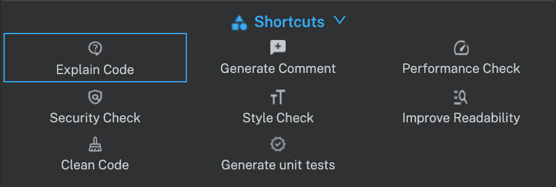
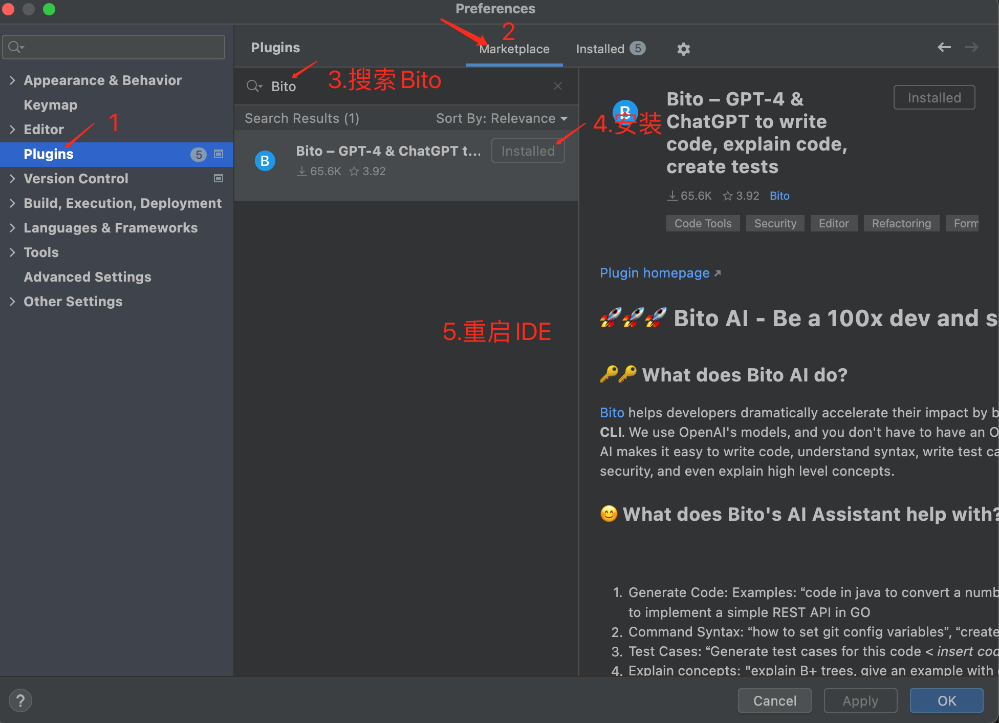
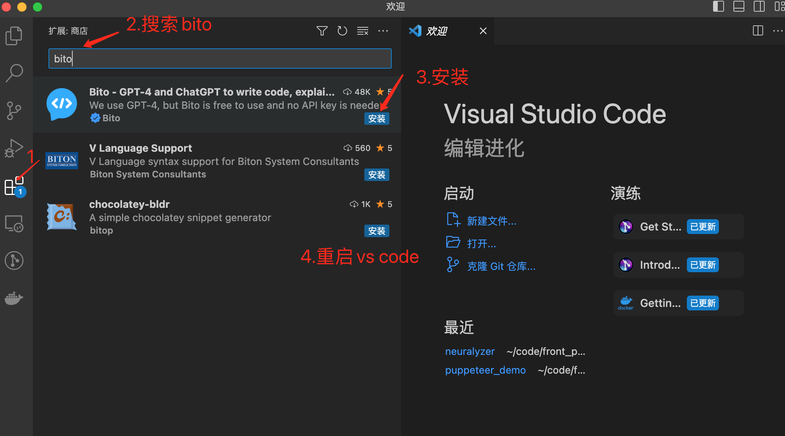
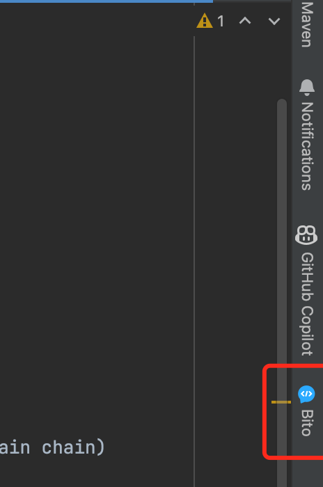
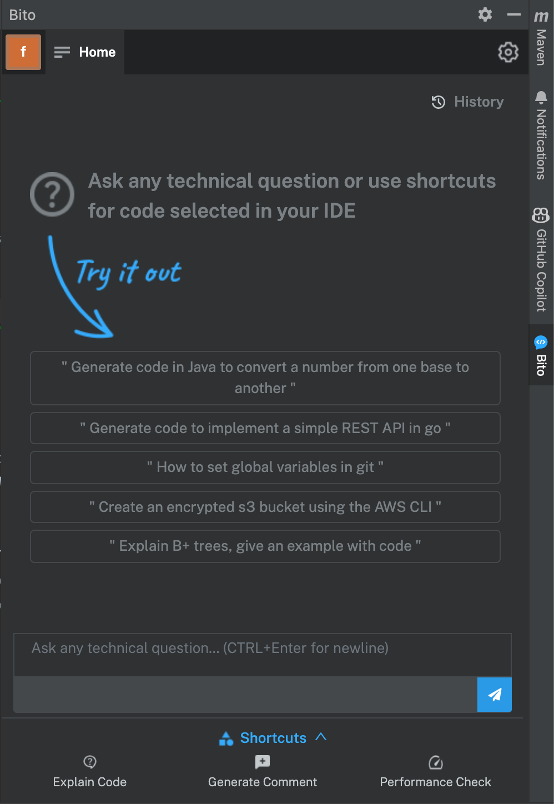
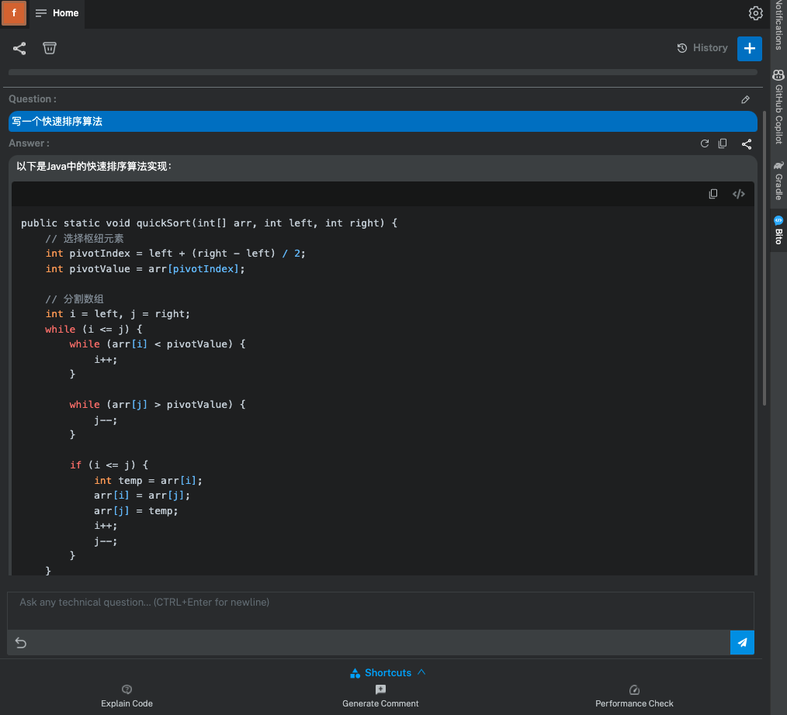
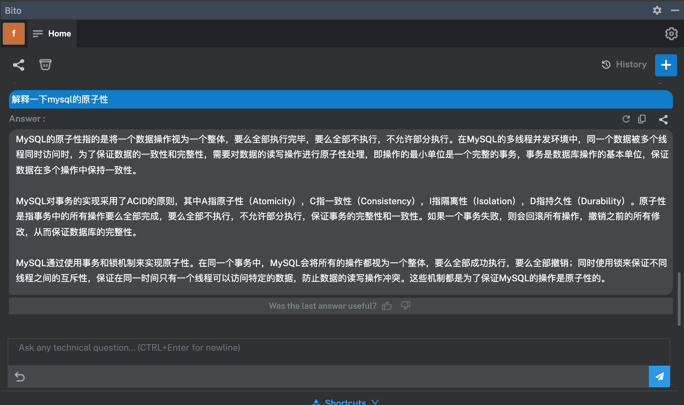
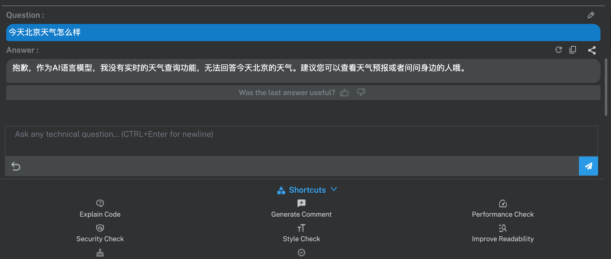

# 基于GPT-4的神仙插件，无需魔法,目前免费

# 一、Bito
## 简介

最近发现一个可以有效提升coding效率的插件神器，截止当前(20230425)已有65k的下载量了！
类似与Cursor一样，可以使用AI辅助写代码，但是又解决Cursor没有语法提示的缺点，只需在IDE中安装插件即可使用，**无需魔法,目前免费**。

根据官网介绍，Bito有助于开发人员通过将GPT-4和ChatGPT引入IDE来大大提高他们的效率。Bito使用了OpenAI的模型，开发者不需要拥有OpenAI密钥,也能使用chatgpt的功能。

其官网介绍如下：

Bito的人工智能帮助开发人员显著加速其影响力。这是一把瑞士军刀，使用是和ChatGPT相同的模型，可以使您的开发人员生产力提高10倍，每天为您节省一个小时！
Bito AI使编写代码、理解语法、编写测试用例、解释代码、评论代码、检查安全性，甚至解释高级概念变得容易。经过数十亿行代码和数百万份文档的培训，我们可以帮助您在不必搜索网络或在乏味的事情上浪费时间的情况下完成任务，这真是令人难以置信。

## 可以做哪些事情
- 1.生成代码： 要求Bito在自然语言提示下生成任何语言的代码。（例如，编写一个Java函数，生成一个快速排序算法等）
- 2.命令语法：询问任何技术命令的语法。（例如，“如何为git设置全局变量？”）
- 3.测试用例：为代码自动生成测试用例。
- 4.解释代码：解释所选代码。询问此代码是如何工作的，或者它做了什么。
- 5.注释方法：为要添加到代码中的函数或方法生成注释。
- 6.提高性能：询问如何提高给定代码的性能。
- 7.检查安全性：询问所选代码是否存在任何已知的安全问题。
- 8.学习技术概念：问一个关于任何技术概念的问题（例如，解释B+tree)

**注：** 公司重要代码，谨慎使用代码扫描和检查！

功能如下：

# 二、如何安装插件
目前Vs code,Jetbrain IDE插件市场都可以搜到，如果没有搜到，可能是IDE的版本过低，不兼容等问题，可以升级版本再试！

- IDEA 

- Vscode 

  

# 三、使用步骤
 以下以IDEA示例：
 - 1.安装插件,重启IDE后，插件生效，在右侧可见bito图标，如下所示： 
   
 - 2.注册登录：点击Bito图标,如果首次使用，点击Sign up注册，否则Sign-in登录
   
   注册如下：
   
 - 3.注册成功，创建workspace，即工作空间,可以加入已有的，或者创建自己的
   
   创建工作空间名称
   
   往下一直点击 Skip Step跳过，可以不用填
   
   
   
  - 4.成功，恭喜，看到这个页面即可在IDE中正常使用了
   
    
# 提问示例
## 一、写一个快速排序算法

## 二、解释mysql的原子性

## 三、询问天气,非技术问题不回答  

# 四、官网地址
[官网地址](https://docs.bito.ai/)

[获取ChatGPT账号](https://github.com/windyund/chatgpt)   

