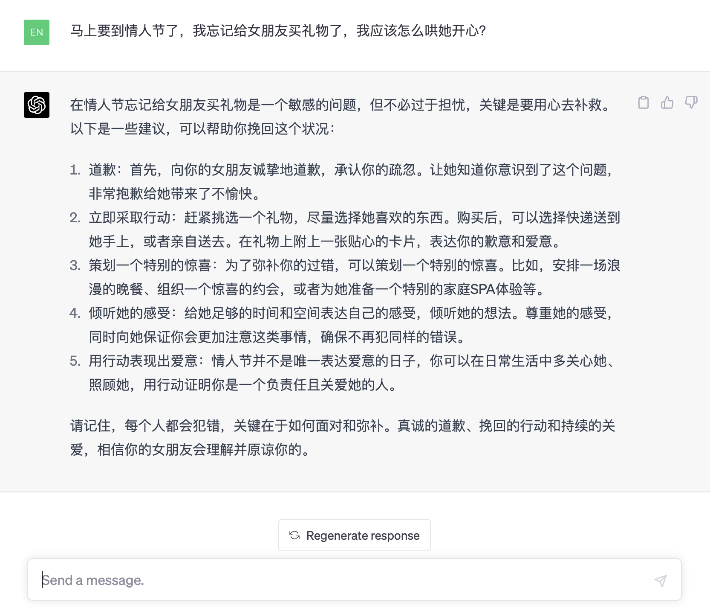

# 当我们在谈论ChatGPT时，我们在谈论什么？
## 一、介绍
北京时间2023年3月15日，OpenAI公司推出了其GPT最新版本GPT-4， 这是其努力扩展深度学习的最新里程碑。 
在此之前，ChatGPT被大家所熟知，它本身并不是OpenAI语言模型的一个版本，而是一个聊天界面，适用于任何支持它的模型。 
过去几个月，ChatGPT一直是基于GPT-3.5，而现在它将基于GPT-4进行交互。 
据OpenAI称，该公司花了六个月的时间使用内部对抗性测试程序和 ChatGPT的训练经验“迭代调整”GPT-4，从而在真实性、可控性等方面取得了最好的效果。
GPT-4 是一个大型多模态模型（接受图像和文本输入，发出文本输出），拥有了图像处理能力，就意味着机器有了"眼睛"，不仅可以简单地要求它描述图片中的内容，还可以深度理解图里的意思并做出反应。
虽然在许多现实世界场景中的能力不如人类，但在各种专业和学术基准上表现出人类水平的表现。

在发布当日颇受关注，热度飙升，百度搜索指数如下图：

## GPT-4相比GPT-3.5有何不同呢
官方从以下几个方面进行基准测试对比结果如下：

### 1.交谈能力
在非正式的交谈中，GPT-3.5和GPT-4的差别并不明显。差异体现在当复杂任务达到某个阈值的时候，GPT-4将更可靠，更有创造性，并能比GPT-3.5更善于处理细致入微的引导。
以下是关于《奥林匹克竞赛》和《AP自由回答问题》的情况对比结果

### 2.多语言翻译精确度
许多现存的机器学习测试基准都是用英语写的。为了测试在其他语言中的能力，我们翻译了MMLU测试基准，一组14,000个多选题，横跨了57个专业，翻译为了多种语言，使用的是Azure 翻译工具（见附录）。在26种语言的24种中，GPT-4都胜出了一些模型的英语语言性能，这些模型包括GPT-3.5和其他的LLMs（Chinchilla，PaLM），甚至在语料稀少的语言上也是如此，这些语言有拉脱维亚语，威尔士语，和斯瓦希里语等

### 3.视觉输入
图像处理和强大的理解能力，允许用户指定任何视觉或语言任务，它输出的是文本（自然语言的形式）
官方给出了7个示例，其中列举4个如下：
- 1.给出一篇论文，解释其中章节含义并总结论文
  
  
- 2.识别图中冷笑话
  
 
- 3.根据给出的图文数据进行推理得出答案
  
  
  
- 4.识别图片不合理的地方，如图：
 

**注：** 图像输入仍然在研究使用，暂未对公众开放

## 二、应用领域
### 1.小镇做题家 (学术研究)
  
   GPT-4在专业和学术方面表现出近似于人类的水平。例如，它在模拟律师考试中的得分能够排进前10%左右，相比之下，GPT-3.5的得分只能排在倒数10%左右。
### 2.Cosplay，假如你是_,你会？(场景设定)
   
### 3.内容生成
   
### 4.聊天助手
  
### 5.编程小能手
 

等等.. AI深刻改变了多种岗位职能，如技术支持，销售，内容编辑，以及编程。虽然它现在还不能替代人类，但已足够强大，我们可以在工作中使用AI辅助提效。

## 三、如何使用
前提：需要魔法
 - 1. 访问[官网](https://chat.openai.com)
 - 2. 注册账号(需手机号验证码，目前暂不支持国内手机号)
 - 3. 升级计划(免费版暂不支持gpt4)
     
    点击左下角
    
    
   
      升级到plus
    
   
      绑定信用卡付费
    

## 局限性
虽然GPT-4模型很强， 但仍有有着于早期GPT模型相似的局限性。最重要的是，它仍然不是完全可靠（它“颠倒”事实，并有逻辑错误）。
即给出一个看似正确，实际错误的答案，经过训练迭代，GPT-4在跑分上高出40%于GPT-3.5。因此我们可以持续期待GPT更新的版本，更强的能力！

[参考官网](https://openai.com/research/gpt-4)

[获取ChatGPT账号-Github](https://github.com/windyund/chatgpt)

[ChatGPT成品账号-直达](https://gpt.vip.coding3min.com)