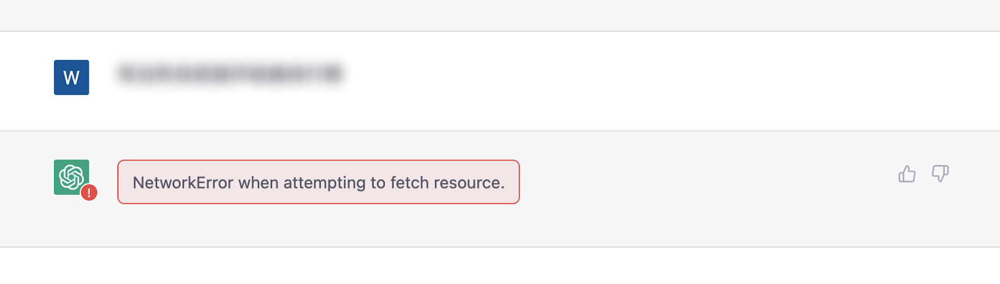
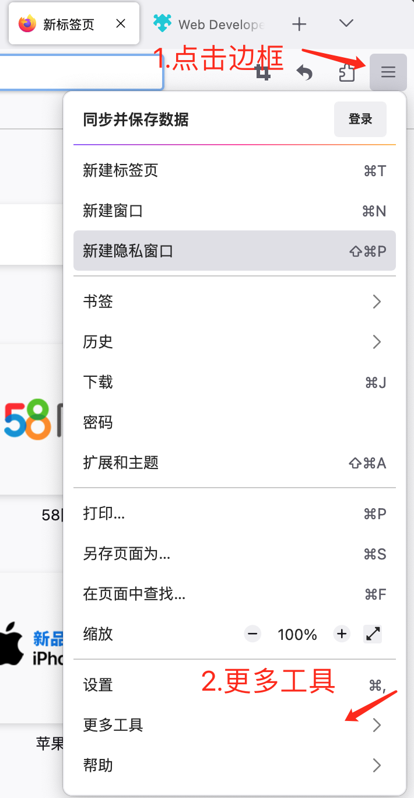

# 一、错误提示
最近⼏天，相信不少人在使用OpenAI的ChatGPT时都发现一个问题，就是官⽹报错越来越频繁了。
当你需⽤ChatGPT来处理⼀些⽐较琐碎的任务时，⼀旦你离开⻚⾯时间⽐较久，或者很长时间没有继续对话，再次返回跟它进⾏对话，就会提示报错！<br>
有以下常见错误：

|  序号   | 错误  |
|  ----  | ----  |
|  1 |  |
| 2  |   |
| 3|   |

# 二、解决方案 
出现以上错误时，一般重新刷新页面，进行一次人机验证，再次回到之前对话框可以解决，但是经常出现这种错误，大家想必很是困扰，尤其是对于使用GPT-4的同学，只能在网页上使用。<br>
不过不用担心，这些问题已经有大神帮我们解决了，只需简单2步，让报错永远消失！
# 三、安装步骤
  ## 电脑端使用
   - 1.安装浏览器插件tampermonkey(油猴脚本)
   - 2.安装KeepChatGPT脚本
   - 3.打开chatGPT页面，可见金色主题
  
   ### 1.Chrome浏览器安装
  1.从[Tampermonkey官网](https://www.tampermonkey.net/) 安装插件  <br>
   
  2.添加到浏览器扩展  <br>
   
  3.安装KeepChatGpt脚本,浏览器直接访问以下链接 <br>

  [KeepChatGPT](https://raw.githubusercontent.com/xcanwin/KeepChatGPT/main/KeepChatGPT.user.js)
   
   检查脚本已启用，生效  <br>
   
   ### 2.Firefox浏览器安装
  [KeepChatGPT](https://raw.githubusercontent.com/xcanwin/KeepChatGPT/main/KeepChatGPT.user.js)
  1.安装插件
  
  
  
  
   2.安装KeepChatGpt脚本,浏览器直接访问以下链接  <br>
  [KeepChatGPT](https://raw.githubusercontent.com/xcanwin/KeepChatGPT/main/KeepChatGPT.user.js)
   ### 3.Edge浏览器安装
  1.安装插件
  
  
   
  2.安装KeepChatGpt脚本,浏览器直接访问以下链接  <br>
    [KeepChatGPT](https://raw.githubusercontent.com/xcanwin/KeepChatGPT/main/KeepChatGPT.user.js)
  3.查看脚本生效 浏览器输入：  <br>
    ```extension://iikmkjmpaadaobahmlepeloendndfphd/options.html#nav=dashboard
    ```
# 四、使用调试

  
- 调试功能 <br>
  可以看到登录账号信息以及访问过程
- 主题功能  <br>
  目前可以在烫金色和暗黑色主题切换，凭个人喜好
- 取消审计功能 <br>
默认情况下，你所有的对话都会被openai官方自动化审计，如果openai审计发现你有过多的违规、违反openai政策 的对话，你的账号就存在被限制甚至被封号的风险。
通过勾选本插件的取消审计功能加上你巧妙的提示词，可以最大程度地免受影响。
- 调整间隔功能 <br>
那个值指的是keep(保活)的时间间隔，单位是秒。
时间间隔越大，keep的速度就越慢，对网站的影响就越小，你的账号就越安全。
时间间隔越小，keep的速度就越快，你的网络错误就越不会出现。
建议间隔30秒以上。 作者平时设置的是150秒，推荐。
  
<br>

了解更多信息，可关注官网[KeepChatGPT](https://github.com/xcanwin/KeepChatGPT/)


[获取ChatGPT账号](https://github.com/windyund/chatgpt)
<hr>