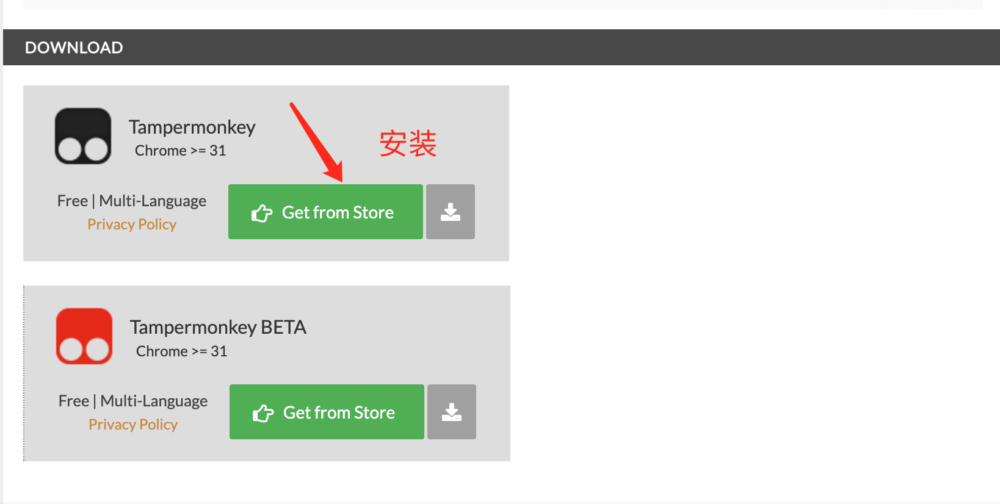

# 突破 GPT4每3小时仅25次回答的限制！修改后不限制GPT4的回答次数

## 概述
花费20美金开通的ChatGPT Plus 订阅，在网页版使用GPT 4模型时，竟然还有限制，每3小时仅能25次回答！  

如果你不够用，那么请按照我提供的步骤，只需要2步就能突破限制。  
<b>插件原理：<b> 我们知道苹果手机APP没有提问次数限制，这个插件就是让我们在网页伪装成手机版提问来绕过这个限制。 
## 1. 成功示例
下图可见，选择多了GPT4-Mobile

## 2. 安装方法-（以谷歌浏览器示例)
   1.安装浏览器插件tampermonkey(油猴脚本)
      访问[Tampermonkey官网](https://www.tampermonkey.net/) 安装插件   
      
      添加到浏览器扩展   
       
   2.安装ChatGPT开启不限次数的GPT4-Mobile插件
     访问[插件地址](https://greasyfork.org/zh-CN/scripts/467317-chatgpt%E5%BC%80%E5%90%AF%E4%B8%8D%E9%99%90%E6%AC%A1%E6%95%B0%E7%9A%84gpt4-mobile)
     
## 3.刷新ChatGPT对话页面使用

[如你需体验，获取ChatGPT账号](https://github.com/windyund/chatgpt)
  